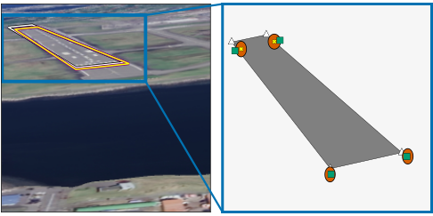

# Integrity Check

In our paper [valentin2025predictive](@cite) we introduce an "integrity check" that lets us compare the reprojection error of the estimated pose to the magnitude of the predicted uncertainties by adopting an algorithm similar to RAIM [joerger2014solution](@cite).
This figure provides a brief illustration, with more details in [valentin2025predictive](@cite).



```@docs; canonical = false
compute_integrity_statistic
```

## Worst-Case Fault Analysis
If a set of measurements and estimated pose passes the integrity check, we next want to determine the **protection level**, which is the maximum deviation in pose from our estimate that could go undetected. This is computed using worst-case fault direction and failure mode slope analysis, which identifies the measurement error patterns most likely to cause unacceptably large positioning errors without triggering the integrity check.

### Usage Example

```julia
using RunwayLib, Unitful.DefaultSymbols, Rotations
	
runway_corners = [
    WorldPoint(0.0m, 50m, 0m),     # near left
    WorldPoint(3000.0m, 50m, 0m),  # far left
    WorldPoint(3000.0m, -50m, 0m),  # far right
    WorldPoint(0.0m, -50m, 0m),    # near right
]

cam_pos = WorldPoint(-2000.0m, 12m, 150m)
cam_rot = RotZYX(roll=1.5°, pitch=5°, yaw=0°)

noise_level = 2.0
sigmas = noise_level * ones(length(runway_corners))
noise_cov = Diagonal(repeat(sigmas .^ 2, inner=2))

H = RunwayLib.compute_H(cam_pos, cam_rot, runway_corners)

alpha_idx = 3           # monitor height error
fault_indices = [1, 2]  # assume faults in first two image measurements
H=H[:, 1:3]             # position-only Jacobian

# Compute worst-case undetected fault subset impact on monitored height
f_dir, g_slope = RunwayLib.compute_worst_case_fault_direction_and_slope(
    alpha_idx,
    fault_indices,
    H,
    noise_cov,
)
```

### API Reference

```@docs; canonical = false
compute_worst_case_fault_direction_and_slope
```

### Theory
This section formalizes the worst-case fault analysis used to compute protection levels following a successful integrity check.

#### Worst-case fault direction
The **worst-case fault direction** ``\mathbf{f}_i`` is the measurement error
pattern within a specified fault subset that maximizes error in the monitored 
parameter while remaining undetectable by the integrity test. Following Joerger 
et al. [joerger2014solution](@cite), we compute it as:

```math
\mathbf{f}_i = \mathbf{A}_i (\mathbf{A}_i^T \mathbf{P} \mathbf{P}^T \mathbf{A}_i)^{-1} (\mathbf{A}_i^T \mathbf{s}_0)
```

#### Failure mode slope
The **failure mode slope** ``g`` quantifies how rapidly the monitored parameter error grows relative to the detection statistic along the worst-case fault direction. Larger values of ``g`` indicate greater vulnerability: small undetected faults can induce large state estimation errors. It is defined as the ratio of the squared mean estimate error to the non-centrality parameter of the test statistic:

```math
g^2 = \mathbf{s}_0^T \mathbf{A}_i (\mathbf{A}_i^T \mathbf{P} \mathbf{P}^T \mathbf{A}_i)^{-1} \mathbf{A}_i^T \mathbf{s}_0
```

#### Definitions
- ``\mathbf{H}`` is the Jacobian matrix relating changes in measurements to changes in pose parameters
- ``\mathbf{P} = (\mathbf{I} - \mathbf{H}(\mathbf{H}^T \mathbf{H})^{-1}\mathbf{H}^T) * L^{-1}`` is the parity projection matrix
- ``\mathbf{\Sigma} = LL^T`` is the noise covariance
- ``\mathbf{A}_i`` is the fault selection matrix corresponding to the measurement indices specified by `fault_indices`
- ``\mathbf{s}_0`` is the extraction vector for the monitored parameter specified by `alpha_idx`

The subscript ``i`` identifies a specific **fault subset** (specified by `fault_indices`) and monitored **parameter** (specified by `alpha_idx`).

```@bibliography
Pages = ["integrity_check.md"]
Canonical = true
```
